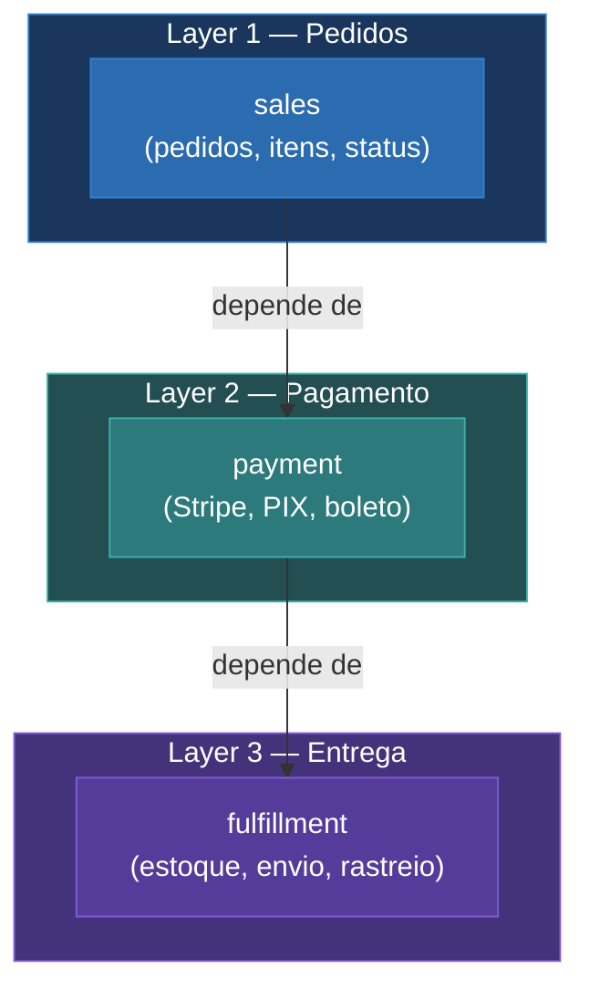

---

# O resultado: 3 módulos onde tinha 1

<v-click>

  ✓ Unidirecional
  ✓ Cada módulo tem responsabilidade clara
  ✓ Boundaries definidos pelo Teste da Deleção

</v-click>

<!--
"Saí de 1 módulo com 100+ arquivos pra 3 módulos com responsabilidade clara. E a chave é: a dependência é UNIDIRECIONAL. Payment depende de sales pra ler o pedido, mas sales NUNCA importa payment. Cada módulo sabe fazer a parte dele e só."

"Mais pra frente eu vou mostrar COMO esses módulos se comunicam na prática. Mas primeiro, vamos ver como eu fiz essa extração com código."
-->
