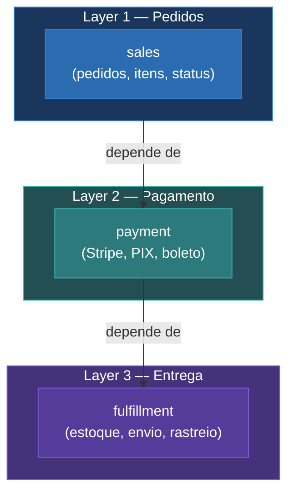

<TitleBlock
  eyebrow="depois da extração"
  outlined="3 MÓDULOS"
  solid="ONDE TINHA 1"
  accent="."
  tail="dependência unidirecional"
  size="small"
/>

<v-click>

  ✓Unidirecional
  ✓Cada módulo tem responsabilidade clara
  ✓Boundaries definidos pelo Teste da Deleção

</v-click>

<!--
"Saí de 1 módulo com 100+ arquivos pra 3 módulos com responsabilidade clara. E a chave é: a dependência é UNIDIRECIONAL. Payment depende de sales pra ler o pedido, mas sales NUNCA importa payment. Cada módulo sabe fazer a parte dele e só."

"Mais pra frente eu vou mostrar COMO esses módulos se comunicam na prática. Mas primeiro, vamos ver como eu fiz essa extração com código."
-->
