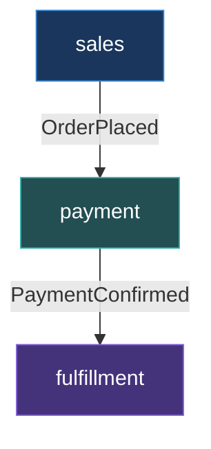

---

# O problema original em código

````md magic-move {lines: true}
```php {all|10-11}
// ANTES: app-modules/sales/Lifecycle/PlaceOrder.php

class PlaceOrder
{
    public function handle(CartCheckedOut $event): void
    {
        // ... valida estoque, calcula total ...
        $order = Order::create([...]);

        event(new OrderPlaced($order));
        dispatch(new ChargePaymentJob($order))->onQueue('payments');
    }
}
```

```php {all|10}
// DEPOIS: app-modules/sales/Lifecycle/PlaceOrder.php

class PlaceOrder
{
    public function handle(CartCheckedOut $event): void
    {
        // ... valida estoque, calcula total ...
        $order = Order::create([...]);

        event(new OrderPlaced($order));
    }
}
```
````

<!--
"Aqui tá a dor em código. PlaceOrder mora no módulo sales. Mas olha a linha 11 — ele faz dispatch(new ChargePaymentJob()). Esse job é do módulo payment. Ou seja: sales depende do payment. Mas payment também depende do sales, porque precisa do modelo Order. Dependência circular."

[click] "Depois: sales só faz event(new OrderPlaced()). Ponto final. Quem escuta e o que faz com isso é problema de quem escutou."
-->

---

# Evento como fronteira

<div class="grid grid-cols-2 gap-6">
<div>

<div class="text-xs opacity-60 mb-2">sales — só dispara o evento</div>

```php
class PlaceOrder
{
    public function handle(...): void
    {
        $order = Order::create([...]);

        event(new OrderPlaced($order));
    }
}
```

</div>
<div>

<v-click>

<div class="text-xs opacity-60 mb-2">payment — decide como cobrar</div>

```php
class StartPaymentProcess
{
    public function handle(
        OrderPlaced $event
    ): void
    {
        dispatch(new ChargePaymentJob(
            $event->order
        ))->onQueue('payments');
    }
}
```

</v-click>

</div>
</div>

<v-click>

<div class="mt-6 p-3 bg-green-900/30 rounded-lg border border-green-500/30 text-sm text-center">
<code>sales</code> nem sabe que <code>payment</code> existe.<br>
Dependência <span class="text-green-400 font-bold">unidirecional</span>: payment → sales. Nunca o contrário.
</div>

</v-click>

<!--
"O StartPaymentProcess tá no módulo payment. ELE decide despachar o job, ELE escolhe a queue, ELE decide qual gateway usar. Sales nem sabe que payment existe. A dependência agora é unidirecional: payment depende de sales (pra ler o pedido), mas sales não depende de ninguém."
-->

---

# O mesmo padrão no final do pipeline

````md magic-move {lines: true}
```php {all|7-10}
// ANTES: ConfirmPaymentJob
class ConfirmPaymentJob
{
    public function handle(): void
    {
        event(new PaymentConfirmed($this->order));

        // Payment decidindo se cria envio
        if ($this->order->requires_shipping) {
            CreateShipmentJob::dispatch($this->order);
        }
    }
}
```

```php
// DEPOIS: payment — só confirma e avisa
class ConfirmPaymentJob
{
    public function handle(): void
    {
        event(new PaymentConfirmed($this->order));
    }
}

// fulfillment — decide se cria envio
class StartFulfillmentOnPayment
{
    public function handle(PaymentConfirmed $event): void
    {
        if ($event->order->requires_shipping) {
            CreateShipmentJob::dispatch($event->order);
        }
    }
}
```
````

<!--
"Mesmo padrão no final do pipeline. Antes, o job de pagamento decidia se criava envio. Mas pagamento não tem NADA a ver com logística. Depois: o job confirma o pagamento, dispara o evento PaymentConfirmed, e acabou. O fulfillment escuta esse evento e decide se cria envio. Cada módulo cuida do seu."
-->

---
layout: two-cols
layoutClass: gap-8
---

# O grafo de dependências

### ANTES


<div class="mt-4 text-red-400 text-sm">
Circular, tudo acoplado.
</div>

::right::

<div class="mt-12"></div>

### DEPOIS



<v-click>

<div class="mt-4 text-sm">
  <div class="text-green-400">✓ Unidirecional</div>
  <div class="text-green-400">✓ Cada camada só depende da anterior</div>
  <div class="text-green-400">✓ Eventos como fronteira</div>
</div>

</v-click>

<!--
"De um espaguete circular pra um grafo unidirecional em 3 camadas. A regra é simples: setas apontam pra baixo, nunca pra cima."

"Agora... parece lindo né? Mas nem tudo foram flores. Fiz a extração e... deu merda."
-->
