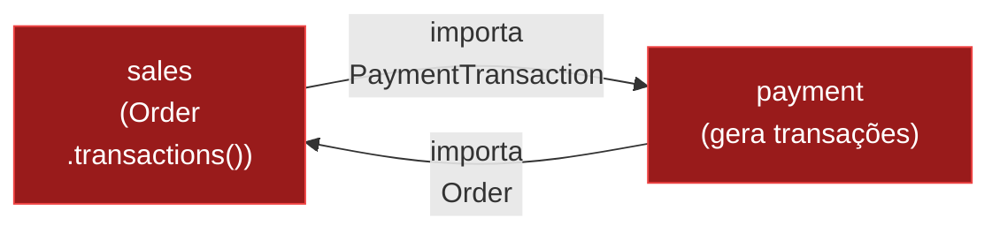

# Fiz a extração e... <span class="g g-b">deu merda</span>.

3 erros reais. 3 lições aprendidas.

<!--
"Até agora parece lindo. Mas vou ser honesto com vocês: eu errei. E errei feio. Vamos falar dos erros."
-->

---
layout: brutalist-base
metaNumber: "26"
metaSection: "IMPLEMENTAÇÃO"
metaSubtitle: "erro 1 — circular surpresa"
contentAlign: "top"
---

# Erro 1: <span class="g g-a">Dependência circular</span> surpresa

<div class="text-sm mb-4">

O modelo `PaymentTransaction` — quem é o dono?

</div>



<v-click>

<div class="mt-4 p-3 rounded text-sm" style="background: rgba(255, 45, 32, 0.08); border: 1px solid rgba(255, 45, 32, 0.3);">
<span style="color: var(--red); font-weight: 700;">Meu erro:</span> achei que <code>PaymentTransaction</code> pertencia ao módulo <code>payment</code>, porque é o payment que cria transações. Mas <code>Order</code> — que mora em <code>sales</code> — tem um <code>->transactions()</code> relationship.
</div>

</v-click>

<!--
"Primeiro erro: achei que PaymentTransaction pertencia ao payment, porque é o módulo que cria transações. Mas Order — que mora em sales — tem um ->transactions() relationship. Resultado: sales importa payment, payment importa sales. Circular de novo."
-->

---
layout: brutalist-base
metaNumber: "27"
metaSection: "IMPLEMENTAÇÃO"
metaSubtitle: "quem é o dono dos dados?"
contentAlign: "top"
---

# Solução: quem é o dono dos dados?

<div class="p-4 rounded text-center text-xl font-bold mb-6" style="background: rgba(255, 165, 58, 0.1); border: 2px solid rgba(255, 165, 58, 0.5);">
O modelo fica com quem <span style="color: var(--accent-orange);">ARMAZENA</span>,<br> não com quem <span style="color: var(--accent-orange);">PRODUZ</span>.
</div>

<v-clicks>

<div class="p-3 rounded text-sm mb-3" style="background: rgba(20, 20, 24, 0.5); border: 1px solid rgba(255, 255, 255, 0.07);">
<span style="opacity: 0.6;">PaymentTransaction é um registro de dados do pedido.</span><br>
Payment <span style="color: var(--accent-blue);">PRODUZ</span> transações. Sales <span style="color: var(--accent-green);">ARMAZENA</span> transações.
</div>

<div class="p-3 rounded text-sm mb-3" style="background: rgba(110, 231, 161, 0.07); border: 1px solid rgba(110, 231, 161, 0.3);">
→ <code>PaymentTransaction</code> mora em <code>sales</code>.<br>
→ <code>payment</code> usa o modelo como dependência.
</div>

<div class="flex justify-center gap-4 text-sm">
  <span style="color: var(--accent-green);">✓ Unidirecional mantido</span>
  <span style="opacity: 0.6;">payment → sales</span>
  <span style="opacity: 0.6;">sales → ninguém</span>
</div>

</v-clicks>

<!--
"A regra que salva: o modelo fica com quem ARMAZENA, não com quem PRODUZ. PaymentTransaction é um dado do pedido — assim como Order, OrderItem, tudo que é persistência. O payment produz a transação, mas quem guarda é sales. Movi o modelo pra sales, e a dependência circular sumiu."
-->

---
layout: brutalist-base
metaNumber: "28"
metaSection: "IMPLEMENTAÇÃO"
metaSubtitle: "erro 2 — listeners duplicados"
contentAlign: "top"
---

# Erro 2: Listeners <span class="g g-a">duplicados</span>

<div class="text-sm mb-4">

**Bug:** Cliente cobrado em DOBRO

</div>

```text
1. PlaceOrder dispatches ChargePaymentJob              ← código antigo
2. StartPaymentProcess dispatches ChargePaymentJob     ← código novo

Pedido chega → ChargePaymentJob × 2 → 💳 COBROU DUAS VEZES 🐛
```

<v-click>

<div class="mt-4 text-sm mb-2 font-bold">Solução: abordagem ADITIVA-DEPOIS-DESTRUTIVA</div>

<v-clicks>

<div class="flex flex-col gap-2 text-sm">
  <div class="p-2 rounded flex items-center gap-2" style="background: rgba(110, 231, 161, 0.07); border: 1px solid rgba(110, 231, 161, 0.3);">
    <span style="color: var(--accent-green); font-family: var(--font-mono); font-weight: 700;">#1</span> Adiciona novo listener (coexiste com o antigo) <span class="ml-auto" style="opacity: 0.6;">← seguro</span>
  </div>
  <div class="p-2 rounded flex items-center gap-2" style="background: rgba(110, 231, 161, 0.07); border: 1px solid rgba(110, 231, 161, 0.3);">
    <span style="color: var(--accent-green); font-family: var(--font-mono); font-weight: 700;">#2</span> Extrai o módulo, remove dispatch antigo <span class="ml-auto" style="opacity: 0.6;">← seguro</span>
  </div>
  <div class="p-2 rounded flex items-center gap-2" style="background: rgba(110, 231, 161, 0.07); border: 1px solid rgba(110, 231, 161, 0.3);">
    <span style="color: var(--accent-green); font-family: var(--font-mono); font-weight: 700;">#3</span> Move código adjacente <span class="ml-auto" style="opacity: 0.6;">← seguro</span>
  </div>
  <div class="p-2 rounded flex items-center gap-2" style="background: rgba(110, 231, 161, 0.07); border: 1px solid rgba(110, 231, 161, 0.3);">
    <span style="color: var(--accent-green); font-family: var(--font-mono); font-weight: 700;">#4</span> Limpa código morto do módulo original <span class="ml-auto" style="opacity: 0.6;">← seguro</span>
  </div>
</div>

</v-clicks>

</v-click>

<!--
"Segundo erro — ou quase-erro. Durante a extração, por um momento tínhamos dois caminhos cobrando o cliente. O código antigo ainda fazia ChargePaymentJob E o listener novo também. Duas cobranças pra mesma compra. Imagina receber duas cobranças de 500 reais no cartão."

"A solução foi sequenciar a extração em 4 steps independentes. Primeiro adiciona o novo caminho sem remover o antigo. O sistema tolera o duplicado graças a um idempotency guard no gateway. Depois remove o caminho antigo. Cada step é deployável e reversível."
-->

---
layout: brutalist-base
metaNumber: "29"
metaSection: "IMPLEMENTAÇÃO"
metaSubtitle: "erro 3 — feature flags"
contentAlign: "top"
---

# Erro 3: Feature flags com prefixo errado

<div class="grid grid-cols-2 gap-6 mt-4">
<div>

```text
Feature flags do pagamento:

  ShopFreeShipping
    ← prefixo "Shop" mas agora
      mora em fulfillment

  ShopInstallmentPayment
    ← prefixo "Shop" mas agora
      mora em payment
```

</div>
<div>

<v-click>

<div class="text-sm">

**Renomear?**

<v-clicks>

<div class="mt-2 p-2 rounded" style="background: rgba(255, 45, 32, 0.08); border: 1px solid rgba(255, 45, 32, 0.3);">
Pennant grava o nome da flag <span style="color: var(--red); font-weight: 700;">no banco</span>
</div>

<div class="mt-2 p-2 rounded" style="background: rgba(255, 45, 32, 0.08); border: 1px solid rgba(255, 45, 32, 0.3);">
Precisa de data migration pra <span style="color: var(--red); font-weight: 700;">todos os tenants</span>
</div>

<div class="mt-2 p-2 rounded" style="background: rgba(255, 45, 32, 0.08); border: 1px solid rgba(255, 45, 32, 0.3);">
Risco: flag ligada vira <span style="color: var(--red); font-weight: 700;">desligada</span> durante deploy
</div>

<div class="mt-3 p-3 rounded font-bold text-center" style="background: rgba(255, 165, 58, 0.1); border: 2px solid rgba(255, 165, 58, 0.5);">
Decisão: manter o prefixo "Shop"<br>
<span class="text-sm font-normal" style="opacity: 0.7;">Inconsistência estética &lt; risco de produção</span>
</div>

</v-clicks>

</div>

</v-click>

</div>
</div>

<!--
"Terceiro: feature flags. As flags se chamavam ShopFreeShipping, ShopInstallmentPayment. Com a extração, elas agora pertencem ao fulfillment e payment. Renomear seria mais 'limpo', mas o Pennant salva o nome da flag no banco. Renomear = migration de dados pra todos os tenants. Decisão pragmática: mantém o prefixo errado. Inconsistência estética é barato. Deploy quebrado é caro."
-->
